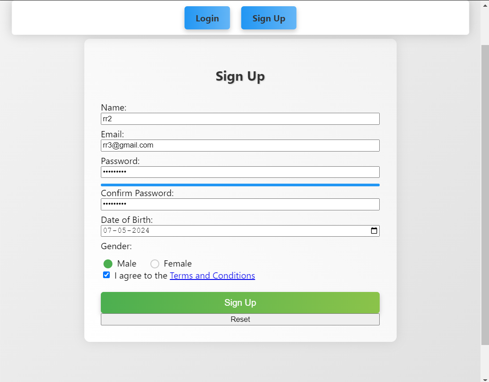
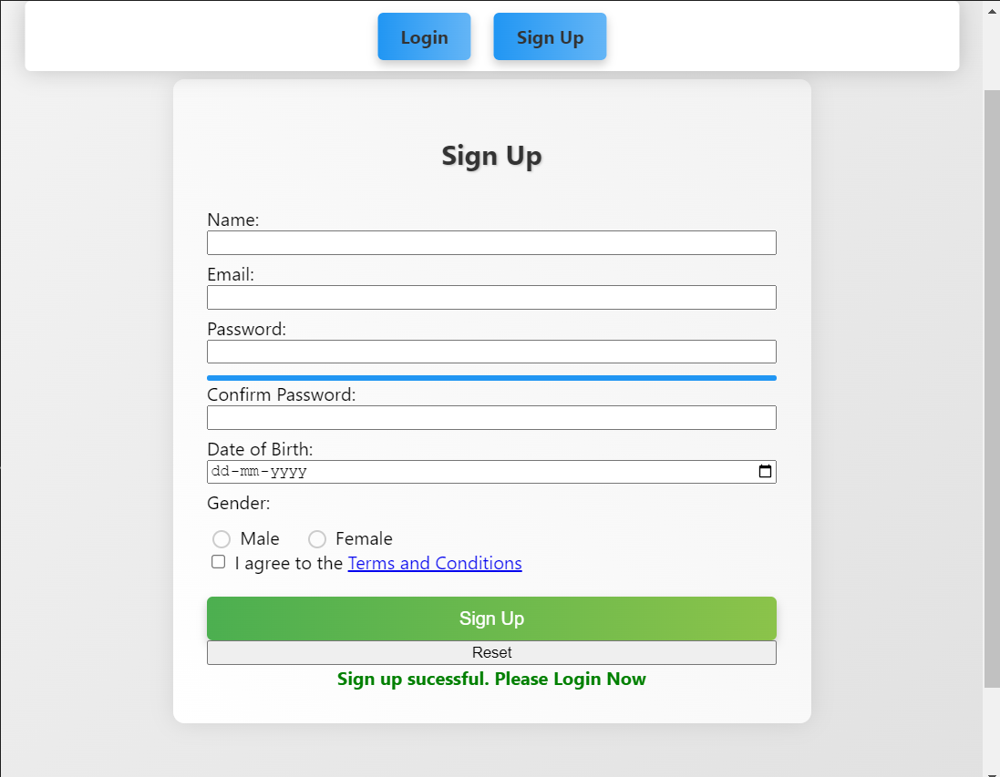
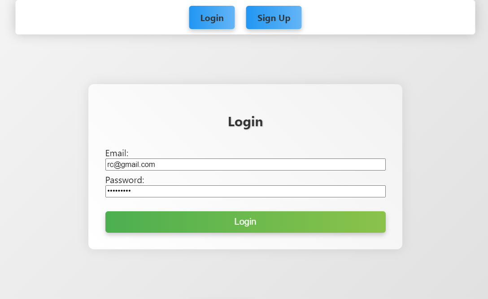
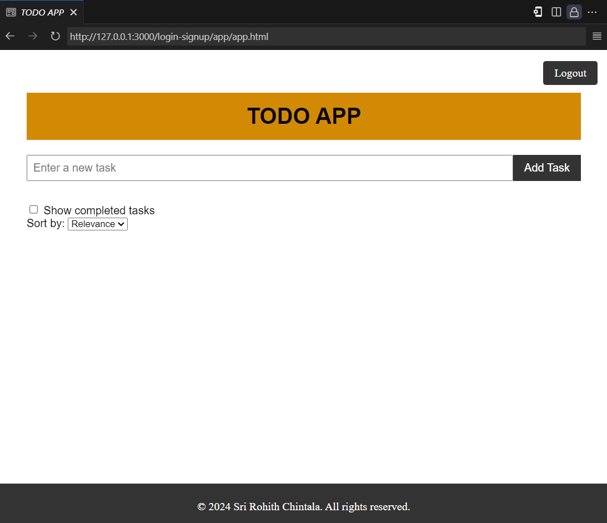
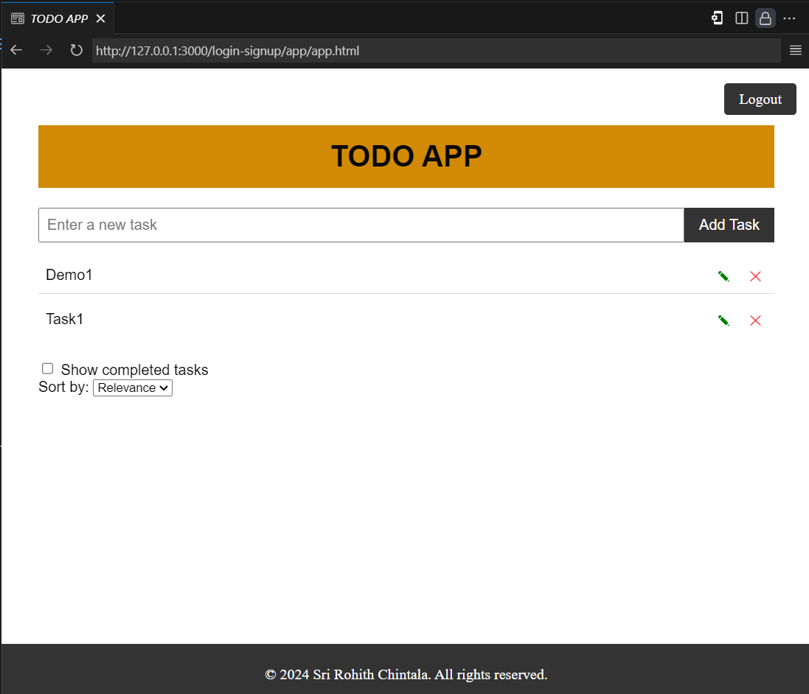

# Login, Sign Up, and Todo App

This project is a comprehensive web application that combines a user authentication system with a powerful Todo App. It offers a seamless experience for users to create accounts, log in, and manage their tasks efficiently. The application is built using modern web technologies, ensuring responsiveness, security, and a smooth user interface.

## Features

### Authentication System

#### Sign Up Page

- **Input Validation**: The sign-up form enforces strict validation rules for all input fields, ensuring data integrity and preventing invalid entries.
- **Name Validation**: The user's name must be at least 4 characters long.
- **Email Validation**: The email address must follow a valid format.
- **Password Validation**: The password must contain at least one uppercase letter and one number, promoting strong and secure passwords.
- **Confirm Password Validation**: The confirm password field must match the entered password to prevent typing errors.
- **Date of Birth Validation**: The date of birth must not be in the future, ensuring valid and consistent data.
- **Gender Selection**: Users can select their gender from a set of radio buttons.
- **Terms and Conditions Agreement**: Users must agree to the terms and conditions before submitting the form.
- **Error Handling**: Appropriate error messages are displayed for invalid inputs, guiding users to correct their entries.
- **Password Strength Meter**: A visual indicator displays the strength of the user's chosen password, encouraging the use of strong and secure passwords.
- **User Data Storage**: Upon successful sign-up, the user's data (name, email, and password) is securely stored in the browser's localStorage for future authentication.
- **Success Message**: After a successful sign-up, a success message is displayed to the user.

#### Login Page

- **Email and Password Validation**: The login form validates the user's email and password inputs. The email must follow a valid format, and the password must meet the required length.
- **Error Handling**: If the user enters invalid credentials, appropriate error messages are displayed to guide the user in correcting the input.
- **User Authentication**: Upon form submission, the entered credentials are checked against the user data stored in the browser's localStorage. If a match is found, the user is authenticated and redirected to the Todo App.
- **Redirect to Sign Up**: Users who do not have an account can easily navigate to the sign-up page by clicking the "Sign Up" link.

### Todo App

#### Task Management

- **Add Tasks**: Users can add new tasks by entering text in the input field and clicking the "Add Task" button or pressing the Enter key.
- **Edit Tasks**: Users can edit existing tasks by clicking the edit icon (pencil symbol) next to the task. This will reveal an input field where the user can modify the task text.
- **Delete Tasks**: Users can delete tasks by clicking the delete icon (cross symbol) next to the task.
- **Mark Tasks as Completed**: Users can mark tasks as completed by clicking on the task text itself. Completed tasks will be visually distinguished from incomplete tasks.

#### Task Organization

- **Show/Hide Completed Tasks**: Users can toggle the visibility of completed tasks using the "Show completed tasks" checkbox, allowing them to focus on either pending or completed tasks.
- **Sort Tasks**: Users can sort tasks by relevance (alphabe@tical order) or date/time using the "Sort by" dropdown, enabling better organization and prioritization of tasks.

#### Data Persistence

- **Local Storage**: Task data is securely stored in the browser's localStorage, ensuring that tasks persist even after refreshing or closing the browser.

#### User Experience

- **Responsive Design**: The entire application, including the login, sign-up, and Todo App pages, is designed to be responsive and adapt to different screen sizes, ensuring a consistent and optimal user experience across various devices.
- **Animations and Transitions**: CSS animations and transitions are incorporated throughout the application, providing smooth transitions between different states of the user interface and enhancing the overall visual appeal.
- **Intuitive User Interface**: The application follows best practices in user interface design, ensuring an intuitive and user-friendly experience for all users.

## Technologies Used

- **HTML5**: The project utilizes the latest HTML5 standards for creating the structure and content of the web pages.
- **CSS3**: Modern CSS3 techniques and features are employed to style the application, providing an appealing and responsive user interface.
- **JavaScript**: The core functionality of the application is implemented using JavaScript, enabling dynamic behavior, form validation, and data manipulation.
- **Local Storage**: The application leverages the browser's localStorage API to securely store and retrieve user data and task information, ensuring data persistence across sessions.

## Usage

1. Open the `index.html` file in a modern web browser to access the login page.
2. If you don't have an account, click the "Sign Up" link to navigate to the sign-up page.
3. On the sign-up page, fill in all the required fields, ensuring that you meet the validation rules for each input.
4. After successful sign-up, you will be redirected to the login page.
5. Enter your email and password, and click the "Login" button.
6. If the credentials are valid, you will be authenticated and redirected to the Todo App.
7. In the Todo App, you can add new tasks by entering text in the input field and clicking the "Add Task" button or pressing the Enter key.
8. To edit a task, click the edit icon (pencil symbol) next to the task. Modify the text in the input field that appears, and the task will be updated when you click outside the input field.
9. To delete a task, click the delete icon (cross symbol) next to the task.
10. To mark a task as completed, click on the task text itself. Completed tasks will have a visually distinct style.
11. Use the "Show completed tasks" checkbox to toggle the visibility of completed tasks.
12. Sort tasks by relevance (alphabetical order) or date/time using the "Sort by" dropdown.
13. Your tasks and user data will be securely stored in the browser's localStorage, allowing you to access them even after refreshing or closing the browser.

Note: This project utilizes the browser's localStorage to store user data and tasks. The data will be cleared if the browser's cache is cleared or if the user switches to a different browser or device.

## References

### Harvard Style Referencing
- LakshayD02 (2023) Signup-Login-Form-with-Validation [Source code]. https://github.com/LakshayD02/Signup-Login-Form-with-Validation [Accessed 18-05-24].

- World Wide Web Consortium (W3C) (2018) CSS Basic User Interface Module Level 3 (CSS3 UI). Available at: https://www.w3.org/TR/css-ui-3/#icon-notation [Accessed: 19-05-2024].

- Shay Howe (n.d.) Responsive Web Design. Available at: https://learn.shayhowe.com/advanced-html-css/responsive-web-design/ [Accessed: 18-05-24].

- Traversy Media (2021) Build a Todo App With JavaScript [Online video]. Available from https://www.youtube.com/watch?v=3OqWCGVaOkA [Accessed 21-05-24].